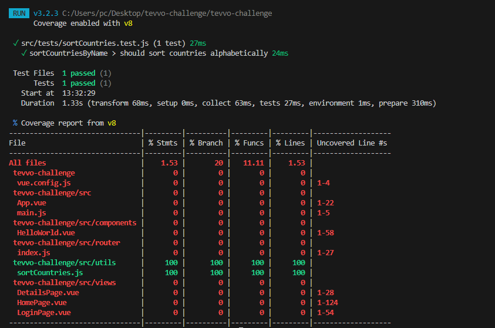

# 🌍 Country Explorer — Tevvo Intern Challenge

This is a Vue.js web app that allows users to log in, view a list of countries, filter them live, and view more details.

## 🖥️ Live Demo

🌐 [Live Demo](https://jocular-blancmange-902c4e.netlify.app/)

## 🔐 Login Credentials

Use the credentials below to access the app:

- **Email**: `user@test.com`
- **Password**: `123456`

## ✨ Features

- 🔒 Login page with local authentication
- 🔄 Route protection using Vue Router guards
- 🌍 Country data fetched from REST Countries API
- 🔎 Real-time filtering/search
- 📄 Country detail page on card click
- ✅ Unit test for sorting function
- 🌐 Deployed on Netlify

## 🚀 Tech Stack

- [Vue 3](https://vuejs.org/)
- [Vue Router](https://router.vuejs.org/)
- [REST Countries API](https://restcountries.com)
- [JavaScript](https://developer.mozilla.org/en-US/docs/Web/JavaScript)
- [Vitest](https://vitest.dev/)

---

## 🧪 Unit Test

I wrote a unit test for the `sortCountriesByName` function to confirm sorting logic.

### ✅ Test Coverage Screenshot



## 📦 Project Setup

```bash
# install dependencies
npm install

# run local server
npm run serve

# build for production
npm run build

# run test with coverage
npm run test
```

## 👩🏽‍💻 Author

- **Name**: Mercy Nyomenda
- **GitHub**: [@MercyN-png](https://github.com/MercyN-png)
